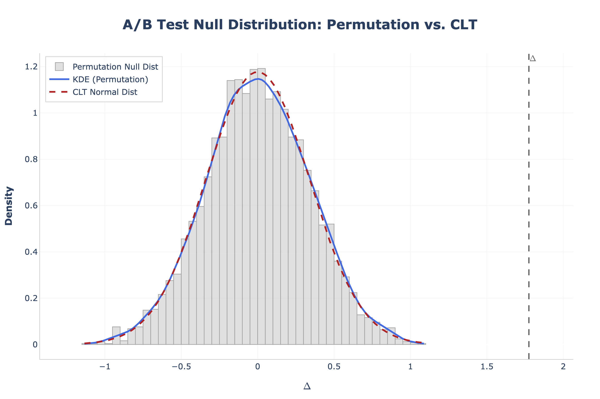

# A/B Testing with Permutation Tests

## Overview

This repository is an early portfolio project focused on **end-to-end A/B testing for business decision-making**. It simulates experimental data, analyzes treatment effects with a **non-parametric permutation test**, and visualizes the null distribution used to evaluate whether an observed uplift is likely to be real.

The project is designed around practical experimentation use cases in **product, marketing, and UX** teams, where the goal is to decide whether a new variant should be shipped, scaled, or investigated further.

## Business Scenario

A company is testing two variants of an experience:

- **Group A** represents the current baseline
- **Group B** represents a new version of a page, campaign, or product flow

The business question is straightforward: **does variant B outperform variant A enough to support a decision?**

This type of workflow is common in:

- landing page optimization
- onboarding and activation experiments
- checkout and conversion funnel tests
- paid marketing creative experiments
- pricing or offer tests
- UX changes intended to improve engagement or monetization

In this project, **Group B is simulated to slightly outperform Group A**, making the repository useful as a realistic demonstration of experimentation logic and statistical evaluation.

## Project Structure

```text
ab-testing/
├── data/
│   ├── ab_test_data.csv
│   └── generate_mock_data.py
├── src/
│   ├── ab_test.py
│   └── ab_test_example.ipynb
├── .gitignore
├── pyproject.toml
└── README.md
```

## Data Generation

The project includes a mock data generator that creates a simple but realistic A/B testing dataset.

Generated fields:

- `user_id`
- `group`
- `converted`
- `revenue`

Simulation logic:

- users are randomly assigned to **Group A** or **Group B**
- **Group A** has a conversion rate of **10%**
- **Group B** has a conversion rate of **12%**
- revenue is generated **only for converted users**
- revenue for **A** is sampled around a mean of **50**
- revenue for **B** is sampled around a mean of **55**
- negative revenue values are clipped to **0**

This setup creates a business-oriented example where B performs modestly better on both **conversion** and **revenue**, which is typical of many real experimentation programs.

## Methodology

The core statistical approach is a **permutation test**.

In intuitive terms, the method works like this:

1. Measure the observed difference between Group B and Group A.
2. Assume there is actually **no real effect** between the two groups.
3. Under that assumption, repeatedly shuffle the group labels many times.
4. Recalculate the difference after each shuffle to build a **null distribution**.
5. Check how extreme the real observed result is compared with that null distribution.

This is useful because it answers the business question directly: if the observed uplift would be very unusual under random chance alone, then the evidence in favor of a real effect is stronger.

The `ABTest` class supports:

- permutation-based null distribution generation
- Monte Carlo p-value computation
- observed delta calculation
- one-sided and two-sided testing
- alternatives: `"greater"`, `"less"`, and `"two-sided"`
- optional comparison with a **CLT-based normal approximation**

## Example Results

Using the simulated dataset, an example analysis might produce:

- **Conversion uplift (B - A): 2.50%**
- **One-sided p-value: 0.0010**
- **Revenue difference (B - A): $1.78**
- **Two-sided p-value: 0.0010**

Business interpretation:

- the treatment group shows a higher conversion rate than the control
- the treatment group also generates higher average revenue per user
- the very small p-values suggest that the observed differences are unlikely to be explained by random assignment alone

This is the kind of output that supports decision-making in **product launches, marketing optimization, and UX experimentation**.

## Visualization

<p align="center">
  
</p>

The project includes a Plotly-based visualization of the null distribution.

The chart can show:

- the permutation-based null distribution
- a KDE curve for a smoother view of the distribution
- the observed delta as a reference line
- an optional **Central Limit Theorem (CLT) normal approximation** for comparison

This makes the analysis easier to communicate to non-technical stakeholders by showing both the observed result and the range of differences expected under the null hypothesis.

The CLT allows us to approximate the $\Delta$ distribution by a normal distribution with a large sample size. Here we can see directly that this indeed happens since the KDE is very close to the CLT line and can be made as close as desired to it by increasing the number of resamples. This shows perfect agreement between the permutation test and the CLT.

## How to Run

Install dependencies with your preferred Python environment setup, then generate data and explore the notebook.

Generate mock data:

```bash
python data/generate_mock_data.py --n_samples 5000
```

Open the notebook for the end-to-end example: `src/ab_test_example.ipynb`

You can also work directly with the `ABTest` class in Python:

```python
import pandas as pd
from src.ab_test import ABTest

df = pd.read_csv("data/ab_test_data.csv")

a_conversion = df.loc[df["group"] == "A", "converted"].to_numpy()
b_conversion = df.loc[df["group"] == "B", "converted"].to_numpy()

test = ABTest(a_conversion, b_conversion)

uplift = test.compute_delta_obs()
p_value = test.compute_p_value(alternative="greater", N=10000)
fig = test.plot_delta_distribution(N=10000, include_clt=True)

print("Observed uplift:", uplift)
print("P-value:", p_value)
fig.show()
```

## Key Features

- End-to-end A/B testing workflow from data generation to interpretation
- Business-oriented experimentation example for product, marketing, and UX decisions
- Non-parametric permutation testing approach
- Monte Carlo p-value estimation
- Support for one-sided and two-sided hypothesis testing
- Plotly visualization of the null distribution
- Optional comparison with a CLT-based normal approximation
- Notebook example for exploratory analysis and presentation

## Possible Extensions

- bootstrap confidence intervals
- statistical power and sample size analysis
- Bayesian A/B testing
- support for additional business metrics
- deployment as a lightweight app or API

## Author

Leonardo de Gioia
